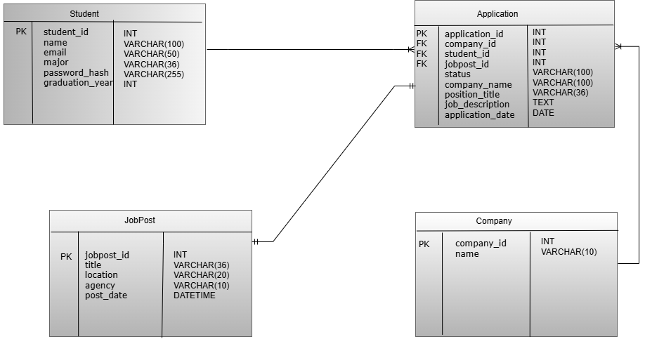

# student-careertrack-portal
A responsive ASP.NET Core MVC web app to help students track job applications, explore government internships via the USAJobs API, and visualize their progress.

---

## API Endpoints Used

We integrated the [USAJobs API](https://developer.usajobs.gov/api-reference/) to fetch public job listings related to student internships.

**Primary Endpoint Used:**

```
https://data.usajobs.gov/api/search?Keyword=Software
```

This endpoint accepts dynamic query parameters like `Keyword` allowing users to search jobs by interest.

---

## Data Model – ERD Diagram

Our application is built on four main entities:

* **Student** – Represents the user submitting applications
* **Application** – Tracks job/internship applications submitted or saved
* **Company** – Stores company-specific data
* **JobPost** – Represents jobs pulled from the USAJobs API

> 

---

## CRUD Implementation Overview

The portal includes full **Create, Read, Update, and Delete** capabilities for job applications.

* **Create**: Students can add new applications manually
* **Read**: View all saved applications with filtering
* **Update**: Modify application status, notes, and details
* **Delete**: Remove applications from the system

These actions are managed through `ApplicationsController` and backed by a singleton service (`IJobManagerService`) to persist data during runtime.

---

## Technical Challenges & Solutions

| Challenge                             | Solution                                                                                   |
| ------------------------------------- | ------------------------------------------------------------------------------------------ |
| API request headers not working       | Configured `HttpClient` with required headers (`User-Agent`, `Authorization-Key`) and host |
| Lost job data on restart              | Used a singleton service to simulate in-memory persistence                                 |
| Chart responsiveness issues           | Replaced static charts with Chart.js, mapped dynamic values from CRUD data                 |
| Hamburger menu breaking on some views | Moved responsive logic from `chart.js` into `site.js` for global layout support            |
| Azure deployment bugs                 | Handled environment-specific config and port mismatches in `launchSettings.json`           |

---

